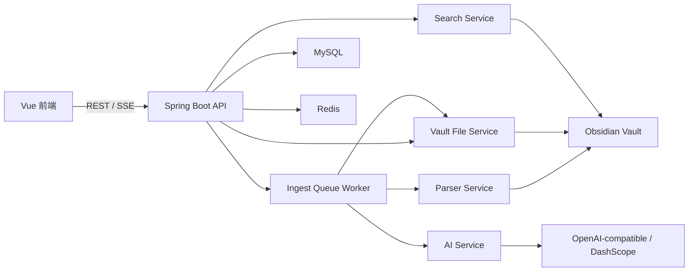

# AI Obsidian Wiki 技术方案 v0.1

版本：v0.1  
日期：2026-05-06  
状态：MVP 实施方案

## 1. 目标与边界

本方案服务于 `ai-obsidian-wiki-prd.md` 中定义的 v0.1 MVP：用户绑定本地 Obsidian Vault，导入文件或网页，系统解析资料并通过 AI 两阶段摄入生成 Obsidian Markdown Wiki，最后支持基于 Vault 的检索问答和引用溯源。

v0.1 做：

- Vault 初始化、绑定、结构检查和安全写入。
- 文件上传、网页 URL 导入、基础文本解析。
- AI 两阶段摄入：资料分析、FILE block 生成。
- 任务队列串行执行、失败重试、取消和恢复。
- Wiki 文件树、Markdown 预览、frontmatter 展示。
- 基础关键词检索、wikilink 一跳扩展、流式 AI 对话。
- 回答保存到 `wiki/synthesis/` 或 `wiki/questions/`。

v0.1 暂不做：

- Chrome 插件、多人协作、云同步。
- 高级知识图谱、社区发现、多模态图片 caption。
- 外部 REST RAG API、MCP Server、Webhook、Reranker。
- 多 Provider 复杂适配和自动合并已有笔记。

## 2. 技术栈

后端：

- Java 21
- Spring Boot 3.5.10
- Spring MVC
- MyBatis Spring Boot Starter 3.0.5
- MySQL 8.x
- Redis 8.x
- Spring AI 1.1.2
- Spring AI Alibaba 1.1.2.0
- DashScope SDK 2.9.2
- OpenAI SDK 4.9.0
- springdoc-openapi 2.8.16
- Log4j2 替换默认 Logback
- Lombok、Jackson、Validation

前端：

- Vue 3
- Vite
- TypeScript
- Naive UI
- lucide-vue-next

工程规范：

- Controller 只接收请求、校验 DTO、调用 Service、返回 `ApiResponse<VO>`。
- ServiceImpl 承担业务逻辑，不直接返回 DO。
- Mapper 仅负责 MyBatis 数据库访问，禁止业务逻辑。
- Controller 入参统一 DTO，出参统一 VO。
- Controller、DTO、VO 加 OpenAPI 注解。
- 类、方法、字段都必须有完整 Javadoc。
- 禁止 `System.out.println`、禁止吞异常、禁止 SQL `${}` 拼接、禁止日志打印 API Key。

## 3. 总体架构



设计取舍：

- 数据库使用 MySQL，而不是 SQLite，因为后端技术栈明确要求 MySQL 8.x。
- Redis 只做轻量队列锁、运行态进度缓存、SSE 会话状态，不作为长期数据源。
- Markdown 文件仍以 Vault 文件系统为真相来源，数据库保存索引、状态和元数据。
- v0.1 不接入向量库；关键词检索先满足 1000 篇 Markdown 1 秒内返回。

## 4. 后端模块划分

建议包名：`com.jihao.aiwiki`

```text
src/main/java/com/jihao/aiwiki/
  common/
    ApiResponse.java
    BusinessException.java
    ErrorCode.java
    GlobalExceptionHandler.java
    PageResult.java
  config/
    OpenApiConfig.java
    RedisConfig.java
    WebMvcConfig.java
  controller/
    VaultController.java
    SourceController.java
    IngestTaskController.java
    WikiController.java
    ChatController.java
    SettingController.java
  service/
    VaultService.java
    SourceDocumentService.java
    IngestTaskService.java
    WikiPageService.java
    ChatService.java
    SearchService.java
    SettingService.java
    impl/
  mapper/
  entity/
  dto/
  vo/
  domain/
    parser/
    ingest/
    search/
    vault/
    llm/
```

`domain/` 放纯业务组件，不直接暴露给 Controller：

- `vault`：路径校验、目录初始化、文件读写、备份。
- `parser`：PDF/TXT/Markdown/HTML/URL/Office 基础解析。
- `ingest`：两阶段 prompt、FILE block 解析和校验。
- `search`：关键词索引、wikilink 扩展、上下文预算。
- `llm`：模型调用、流式输出、Provider 适配。

## 5. 核心数据模型

v0.1 不强制使用数据库外键，统一由 Service 层做存在性校验和 Vault 隔离。原因是本项目以本地 Vault 文件为真相源，重建索引和任务恢复会频繁按文件系统状态修正数据库记录。

### 5.1 vault_project

```sql
CREATE TABLE vault_project (
  id BIGINT PRIMARY KEY AUTO_INCREMENT COMMENT '主键 ID',
  name VARCHAR(128) NOT NULL COMMENT 'Vault 名称',
  path VARCHAR(1024) NOT NULL COMMENT 'Vault 绝对路径',
  purpose VARCHAR(1024) DEFAULT NULL COMMENT '知识库目标摘要',
  status VARCHAR(32) NOT NULL DEFAULT 'READY' COMMENT '状态',
  last_indexed_at DATETIME DEFAULT NULL COMMENT '最近索引时间',
  deleted TINYINT NOT NULL DEFAULT 0 COMMENT '逻辑删除',
  create_time DATETIME NOT NULL DEFAULT CURRENT_TIMESTAMP COMMENT '创建时间',
  update_time DATETIME NOT NULL DEFAULT CURRENT_TIMESTAMP ON UPDATE CURRENT_TIMESTAMP COMMENT '更新时间',
  UNIQUE KEY uk_vault_path (path(255))
) COMMENT='Vault 项目表';
```

### 5.2 source_document

```sql
CREATE TABLE source_document (
  id BIGINT PRIMARY KEY AUTO_INCREMENT COMMENT '主键 ID',
  vault_id BIGINT NOT NULL COMMENT 'Vault ID',
  type VARCHAR(32) NOT NULL COMMENT '资料类型',
  title VARCHAR(256) NOT NULL COMMENT '资料标题',
  original_path VARCHAR(1024) NOT NULL COMMENT '原始文件相对路径',
  original_hash VARCHAR(64) DEFAULT NULL COMMENT '原始文件哈希',
  extracted_text_path VARCHAR(1024) DEFAULT NULL COMMENT '解析文本相对路径',
  source_url VARCHAR(2048) DEFAULT NULL COMMENT '网页原始 URL',
  status VARCHAR(32) NOT NULL COMMENT '状态',
  error_message VARCHAR(1024) DEFAULT NULL COMMENT '错误信息',
  deleted TINYINT NOT NULL DEFAULT 0 COMMENT '逻辑删除',
  create_time DATETIME NOT NULL DEFAULT CURRENT_TIMESTAMP COMMENT '创建时间',
  update_time DATETIME NOT NULL DEFAULT CURRENT_TIMESTAMP ON UPDATE CURRENT_TIMESTAMP COMMENT '更新时间',
  UNIQUE KEY uk_vault_original_path (vault_id, original_path(255)),
  KEY idx_vault_status (vault_id, status),
  KEY idx_vault_type (vault_id, type)
) COMMENT='原始资料表';
```

### 5.3 ingest_task

```sql
CREATE TABLE ingest_task (
  id BIGINT PRIMARY KEY AUTO_INCREMENT COMMENT '主键 ID',
  task_id VARCHAR(64) NOT NULL COMMENT '业务任务 ID',
  vault_id BIGINT NOT NULL COMMENT 'Vault ID',
  source_id BIGINT NOT NULL COMMENT '资料 ID',
  status VARCHAR(32) NOT NULL COMMENT '任务状态',
  stage VARCHAR(32) NOT NULL DEFAULT 'PENDING' COMMENT '执行阶段',
  progress INT NOT NULL DEFAULT 0 COMMENT '进度 0-100',
  retry_count INT NOT NULL DEFAULT 0 COMMENT '已重试次数',
  error_message VARCHAR(1024) DEFAULT NULL COMMENT '错误信息',
  written_files JSON DEFAULT NULL COMMENT '已写入文件',
  started_at DATETIME DEFAULT NULL COMMENT '开始时间',
  heartbeat_at DATETIME DEFAULT NULL COMMENT 'Worker 心跳时间',
  finished_at DATETIME DEFAULT NULL COMMENT '结束时间',
  create_time DATETIME NOT NULL DEFAULT CURRENT_TIMESTAMP COMMENT '创建时间',
  update_time DATETIME NOT NULL DEFAULT CURRENT_TIMESTAMP ON UPDATE CURRENT_TIMESTAMP COMMENT '更新时间',
  UNIQUE KEY uk_task_id (task_id),
  KEY idx_vault_status (vault_id, status),
  KEY idx_source_id (source_id),
  KEY idx_heartbeat (status, heartbeat_at)
) COMMENT='摄入任务表';
```

`stage` 用于恢复时判断任务是否可重跑：

- `PENDING`：等待领取。
- `PARSING`：解析资料。
- `ANALYZING`：AI 阶段一。
- `WRITING`：AI 阶段二与文件写入。
- `INDEXING`：更新 Wiki 索引。

### 5.4 wiki_page

```sql
CREATE TABLE wiki_page (
  id BIGINT PRIMARY KEY AUTO_INCREMENT COMMENT '主键 ID',
  vault_id BIGINT NOT NULL COMMENT 'Vault ID',
  path VARCHAR(1024) NOT NULL COMMENT 'Wiki 相对路径',
  title VARCHAR(256) NOT NULL COMMENT '页面标题',
  type VARCHAR(32) NOT NULL COMMENT '页面类型',
  tags JSON DEFAULT NULL COMMENT '标签',
  related JSON DEFAULT NULL COMMENT '关联页面',
  content_hash VARCHAR(64) DEFAULT NULL COMMENT '内容哈希',
  deleted TINYINT NOT NULL DEFAULT 0 COMMENT '逻辑删除',
  create_time DATETIME NOT NULL DEFAULT CURRENT_TIMESTAMP COMMENT '创建时间',
  update_time DATETIME NOT NULL DEFAULT CURRENT_TIMESTAMP ON UPDATE CURRENT_TIMESTAMP COMMENT '更新时间',
  UNIQUE KEY uk_vault_path (vault_id, path(255)),
  KEY idx_vault_type (vault_id, type)
) COMMENT='Wiki 页面索引表';
```

### 5.5 chat_session / chat_message

```sql
CREATE TABLE chat_session (
  id BIGINT PRIMARY KEY AUTO_INCREMENT COMMENT '主键 ID',
  vault_id BIGINT NOT NULL COMMENT 'Vault ID',
  title VARCHAR(256) NOT NULL COMMENT '会话标题',
  deleted TINYINT NOT NULL DEFAULT 0 COMMENT '逻辑删除',
  create_time DATETIME NOT NULL DEFAULT CURRENT_TIMESTAMP COMMENT '创建时间',
  update_time DATETIME NOT NULL DEFAULT CURRENT_TIMESTAMP ON UPDATE CURRENT_TIMESTAMP COMMENT '更新时间',
  KEY idx_vault_id (vault_id)
) COMMENT='对话会话表';

CREATE TABLE chat_message (
  id BIGINT PRIMARY KEY AUTO_INCREMENT COMMENT '主键 ID',
  session_id BIGINT NOT NULL COMMENT '会话 ID',
  role VARCHAR(32) NOT NULL COMMENT '角色：user/assistant',
  content MEDIUMTEXT NOT NULL COMMENT '消息内容',
  references_json JSON DEFAULT NULL COMMENT '引用来源',
  create_time DATETIME NOT NULL DEFAULT CURRENT_TIMESTAMP COMMENT '创建时间',
  KEY idx_session_id (session_id)
) COMMENT='对话消息表';
```

### 5.6 app_setting

```sql
CREATE TABLE app_setting (
  id BIGINT PRIMARY KEY AUTO_INCREMENT COMMENT '主键 ID',
  vault_id BIGINT NOT NULL COMMENT 'Vault ID',
  provider VARCHAR(64) NOT NULL COMMENT '模型提供商',
  base_url VARCHAR(512) NOT NULL COMMENT '模型 API Base URL',
  api_key_cipher TEXT DEFAULT NULL COMMENT '加密后的 API Key',
  model VARCHAR(128) NOT NULL COMMENT '模型名称',
  max_context_size INT NOT NULL DEFAULT 32000 COMMENT '最大上下文',
  temperature DECIMAL(3,2) NOT NULL DEFAULT 0.20 COMMENT '温度',
  output_language VARCHAR(32) NOT NULL DEFAULT 'Chinese' COMMENT '输出语言',
  embedding_enabled TINYINT NOT NULL DEFAULT 0 COMMENT '是否启用 embedding',
  create_time DATETIME NOT NULL DEFAULT CURRENT_TIMESTAMP COMMENT '创建时间',
  update_time DATETIME NOT NULL DEFAULT CURRENT_TIMESTAMP ON UPDATE CURRENT_TIMESTAMP COMMENT '更新时间',
  UNIQUE KEY uk_vault_id (vault_id)
) COMMENT='系统设置表';
```

## 6. API 设计

统一响应：

```json
{
  "code": 200,
  "message": "success",
  "data": {}
}
```

### 6.1 Dashboard

| 方法 | 路径 | 说明 |
|------|------|------|
| GET | `/api/dashboard/overview?vaultId=1` | 获取 Vault 概览、统计、最近资料、当前任务 |

### 6.2 Vault

| 方法 | 路径 | 说明 |
|------|------|------|
| POST | `/api/vault/init` | 初始化或绑定 Vault |
| GET | `/api/vault/detail` | 获取当前 Vault |
| POST | `/api/vault/reindex` | 重建 Wiki 索引 |

关键校验：

- 路径存在且可读写。
- 真实路径必须等于 canonical path，避免软链绕过。
- 只创建缺失的 `purpose.md`、`schema.md`、`wiki/index.md` 和目录结构。
- 不读取或修改 `.obsidian/`。

### 6.3 Sources

| 方法 | 路径 | 说明 |
|------|------|------|
| POST | `/api/sources/upload` | 上传文件并保存到 `raw/sources/` |
| POST | `/api/sources/import-url` | 导入网页 URL |
| GET | `/api/sources/page` | 分页查询资料 |
| GET | `/api/sources/detail` | 获取资料详情 |
| GET | `/api/sources/preview` | 获取解析文本预览 |
| POST | `/api/sources/{id}/parse` | 手动重新解析 |
| POST | `/api/sources/{id}/ingest` | 创建摄入任务 |

上传策略：

- 文件名 slug 化，冲突时追加 `-2`、`-3`。
- 原始文件写入 `raw/sources/files/`。
- URL 抓取保存到 `raw/sources/webclips/`，记录原链接。
- 解析文本写入 `.ai-wiki/cache/`，数据库只保存相对路径。

### 6.4 Tasks

| 方法 | 路径 | 说明 |
|------|------|------|
| GET | `/api/tasks/page` | 分页查询队列 |
| GET | `/api/tasks/detail` | 获取任务详情 |
| POST | `/api/tasks/{taskId}/retry` | 重试失败任务 |
| POST | `/api/tasks/{taskId}/cancel` | 取消任务 |
| GET | `/api/tasks/stream` | SSE 推送任务进度 |

队列规则：

- 同一 `vault_id` 同时只允许一个 `PROCESSING`。
- 失败自动重试 3 次。
- Worker 每 10 秒更新一次 `heartbeat_at`。
- 服务启动时扫描 `PENDING` 和心跳超时的 `PROCESSING` 任务。
- 心跳超时阈值默认 5 分钟，可通过配置调整。
- `PARSING`、`ANALYZING`、`INDEXING` 可自动恢复；`WRITING` 只能进入人工检查或幂等恢复流程。
- 取消只对 `PENDING` 或未进入 `WRITING` 的 `PROCESSING` 生效。

### 6.5 Wiki

| 方法 | 路径 | 说明 |
|------|------|------|
| GET | `/api/wiki/tree` | 获取 `wiki/` 文件树 |
| GET | `/api/wiki/page` | 获取 Markdown 页面 |
| POST | `/api/wiki/open` | 打开对应 Obsidian 文件路径 |
| GET | `/api/wiki/search` | 关键词搜索 Wiki |

路径安全：

- `path` 必须是相对路径。
- 必须以 `wiki/` 开头。
- 禁止 `../`、绝对路径、Windows 盘符、空字节。
- 读取前使用 canonical path 确认仍位于 Vault 内。

### 6.6 Chat

| 方法 | 路径 | 说明 |
|------|------|------|
| POST | `/api/chat/session` | 创建会话 |
| GET | `/api/chat/sessions` | 查询会话列表 |
| GET | `/api/chat/messages` | 查询消息 |
| POST | `/api/chat/stream` | SSE 流式问答 |
| POST | `/api/chat/save-answer` | 保存回答到 Wiki |

`ChatStreamDTO`：

- `vaultId`
- `sessionId`
- `question`
- `maxReferences`

SSE 事件：

```text
event: reference
data: [{"id":1,"path":"wiki/concepts/agent-memory.md"}]

event: delta
data: {"content":"当前资料把 Agent Memory 分成三层"}

event: done
data: {"messageId":1001}
```

### 6.7 Settings

| 方法 | 路径 | 说明 |
|------|------|------|
| GET | `/api/settings/detail` | 获取设置 |
| PUT | `/api/settings/update` | 更新模型和索引设置 |
| POST | `/api/settings/test-llm` | 测试 LLM 连通性 |

LLM API Key 存储：

- 不明文入库。
- 使用本机应用密钥加密后保存 `api_key_cipher`。
- 返回 VO 时只返回 masked key，例如 `sk-****abcd`。
- 日志中禁止打印完整 key、请求体和模型响应原文。

## 7. 核心流程

### 7.1 Vault 初始化

默认创建：

- `purpose.md`
- `schema.md`
- `raw/sources/`
- `raw/assets/`
- `wiki/index.md`
- `wiki/log.md`
- `wiki/overview.md`
- `wiki/sources/`
- `wiki/entities/`
- `wiki/concepts/`
- `wiki/questions/`
- `wiki/synthesis/`
- `.ai-wiki/cache/`
- `.ai-wiki/history/`

### 7.2 文件和 URL 导入

解析实现：

- PDF：Apache PDFBox。
- TXT / Markdown / JSON / CSV：按 UTF-8 优先，失败时探测编码。
- HTML / URL：Jsoup 抽取标题、正文、原链接。
- DOCX / PPTX / XLSX：Apache POI 基础文本和表格抽取。
- 图片：v0.1 只保存引用，不做 OCR 或视觉 caption。

### 7.3 AI 两阶段摄入

阶段一：资料分析。

输入：

- `purpose.md`
- `schema.md`
- `wiki/index.md`
- 解析后的 source 文本
- 已有相关 Wiki 页面片段

输出 JSON：

- summary
- entities
- concepts
- keyPoints
- relatedPages
- conflicts
- reviewQuestions
- proposedPages

阶段二：生成 FILE block。

```text
---FILE: wiki/sources/source-name.md---
---
type: source
title: Source Name
sources:
  - raw/sources/source-name.pdf
tags: []
related: []
created: 2026-04-30
updated: 2026-04-30
---

# Source Name

...
---END FILE---
```

FILE block 校验：

- 必须有 `---FILE:` 和 `---END FILE---`。
- 文件路径只允许 `wiki/`。
- 禁止绝对路径、`../`、空路径、反斜杠路径穿越。
- Markdown 必须有 frontmatter。
- frontmatter 必须包含 `type`、`title`、`sources`、`updated`。
- `type` 必须属于允许枚举。
- 写入前先写临时文件，再原子替换。
- 更新 `wiki/index.md`、`wiki/overview.md` 前保留 `.ai-wiki/history/` 版本。

### 7.4 任务恢复与写入幂等

写入阶段需要避免半成品：

- 所有目标文件先写到 `.ai-wiki/tmp/{taskId}/`。
- 校验通过后再逐个原子替换到 `wiki/`。
- `written_files` 只记录已完成原子替换的文件。
- `WRITING` 阶段崩溃后，恢复流程先比对 `written_files`、临时目录和 `wiki/log.md`。
- 无法判断一致性时，任务标记 `FAILED`，错误原因写明需要人工检查，不自动覆盖。

### 7.5 检索与对话

MVP 检索策略：

1. 扫描 `wiki_page` 表做文件名和标题匹配。
2. 读取候选 Markdown 正文做关键词匹配。
3. 抽取候选页面内 `[[wikilink]]`，做一跳扩展。
4. 按分数、更新时间、页面类型排序。
5. 按 `maxContextSize` 组装上下文。

回答规则：

- 系统 prompt 明确要求只基于检索上下文回答。
- 信息不足时必须说明“不足以判断”。
- 引用格式固定为 `[1] wiki/concepts/agent-memory.md`。
- references 结构化返回给前端，便于点击打开 Wiki。

保存回答：

- 用户选择保存为 `wiki/synthesis/*.md` 或 `wiki/questions/*.md`。
- 仍走同一套路径校验和 frontmatter 校验。
- 写入 `wiki/log.md` 记录保存动作。

## 8. 安全设计

路径安全是本项目最高风险点：

- 所有外部传入路径统一走 `VaultPathValidator`。
- 文件系统访问全部使用 canonical path 校验。
- 业务层只接受相对路径，绝对路径只存在 Vault 配置中。
- 写入只允许 `wiki/` 和 `.ai-wiki/` 内部状态目录。
- 原始资料 `raw/` 不允许被 LLM 输出覆盖。
- 删除操作必须二次确认，v0.1 可先只做逻辑删除和隐藏。

LLM 安全：

- LLM 输出不能直接写文件，必须经过 FILE block parser 和 validator。
- prompt 中明确禁止输出 `../`、绝对路径、非 `wiki/` 路径。
- 对不确定结论写入 Review Queue，不直接覆盖旧页面。
- 模型原始响应只在 debug 开关下脱敏落盘，默认不保存完整内容。

接口安全：

- DTO 参数校验。
- 文件上传限制大小和扩展名。
- URL 导入只允许 `http` / `https`。
- 防 SSRF：禁止访问内网 IP、localhost、metadata 地址。
- 日志脱敏 API Key、Authorization、Cookie。

## 9. 性能与可靠性

性能目标：

- 1000 篇 Markdown 内关键词搜索 1 秒内完成。
- 大文件解析和 AI 摄入都在后台任务执行。
- 对话使用 SSE 流式返回首 token，避免长时间阻塞。

可靠性：

- 任务事实状态在 MySQL，不依赖内存。
- Worker 启动时恢复未完成任务。
- 写文件前先写 `.tmp`，校验后原子替换。
- 写入关键页面前生成 `.ai-wiki/history/{timestamp}/` 备份。
- 每个任务记录 `wiki/log.md`，便于 Obsidian 侧追踪。

## 10. 开发顺序

1. 后端基础工程：Spring Boot、MyBatis、MySQL、Redis、OpenAPI、统一响应和异常。
2. Vault 模块：初始化、路径校验、目录创建、Wiki 文件读取。
3. Source 模块：文件上传、URL 导入、资料列表、解析预览。
4. Parser 模块：PDF、TXT、Markdown、HTML/URL 基础解析。
5. Settings 模块：LLM 配置保存、API Key 加密、连通性测试。
6. Ingest Task 模块：任务表、队列领取、状态更新、SSE 进度。
7. AI 摄入模块：阶段一分析、阶段二 FILE block、写入校验。
8. Wiki 模块：文件树、页面预览、索引重建。
9. Search 模块：关键词检索、wikilink 一跳扩展、上下文预算。
10. Chat 模块：会话、流式问答、引用、保存回答到 Wiki。
11. Review Queue 和安全增强：冲突、不确定问题、历史版本查看。

## 11. 测试策略

单元测试：

- `VaultPathValidatorTest`：路径穿越、绝对路径、Windows 盘符、软链。
- `FileBlockParserTest`：正常 block、多文件 block、缺 END、非法 frontmatter。
- `MarkdownFrontmatterValidatorTest`：必填字段和 type 枚举。
- `KeywordSearchServiceTest`：标题、文件名、正文、wikilink 权重。
- `ContextBudgetServiceTest`：上下文截断和引用保留。
- `IngestTaskRecoveryTest`：心跳超时、WRITING 阶段崩溃、幂等恢复。

集成测试：

- Vault 初始化不破坏 `.obsidian/`。
- 上传 PDF 后生成 source_document 和 extracted text。
- 创建摄入任务后状态从 `PENDING` 到 `DONE`。
- LLM 输出非法路径时任务失败且无文件写入。
- Chat SSE 返回 reference、delta、done。

端到端验收：

- 5 分钟内完成 Vault 初始化。
- 导入 PDF 或网页后生成 `wiki/sources/*.md`。
- 更新 `wiki/index.md` 和 `wiki/log.md`。
- Chat 回答展示至少一个引用来源。
- 保存回答后 Obsidian 能直接阅读对应 Markdown。

## 12. 主要风险与决策

| 风险 | 影响 | 处理 |
|------|------|------|
| 本地文件路径写入风险 | 高 | canonical path 校验、只允许 `wiki/`、原子写入 |
| LLM 输出不稳定 | 高 | FILE block parser、frontmatter 校验、失败不写入 |
| URL 导入 SSRF | 高 | 禁止内网 IP、localhost、metadata 地址 |
| 写入阶段崩溃 | 高 | `stage`、`heartbeat_at`、临时目录和原子替换 |
| 大文件解析慢 | 中 | 后台任务、进度推送、解析缓存 |
| 关键词检索质量不足 | 中 | v0.1 先满足 MVP，v0.2 再接向量检索 |
| 多 Provider 维护成本 | 中 | v0.1 只稳定 OpenAI-compatible，DashScope 作为技术栈兼容项 |

## 13. v0.1 完成标准

- 前端六个页面均接入真实 API，不再依赖 mock 数据。
- 后端 OpenAPI 文档可查看所有 v0.1 接口。
- 上传 PDF/TXT/Markdown 或导入 URL 后能看到解析预览。
- 点击 AI 摄入后任务进入队列，并能在 Tasks 页面看到进度。
- 摄入成功后 Vault 内出现 Obsidian 可读的 Markdown 页面。
- Chat 页面能流式返回答案和引用来源。
- 保存回答能写入 `wiki/synthesis/` 或 `wiki/questions/`。
- 所有文件写入均经过路径和 frontmatter 校验。
