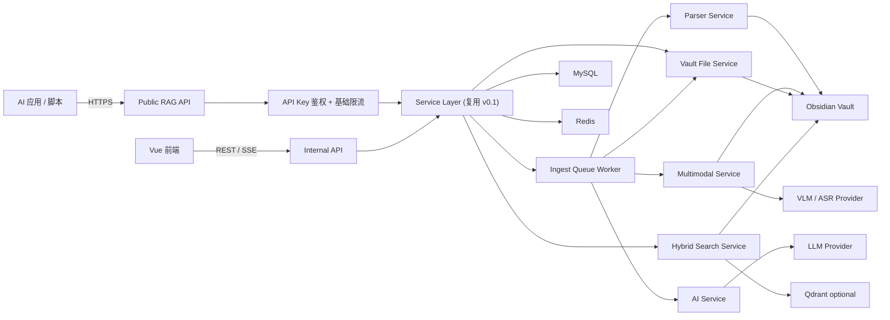
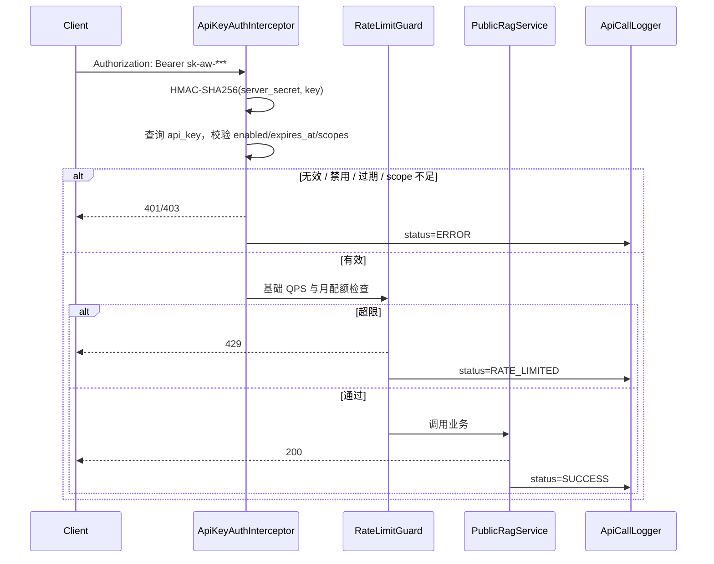
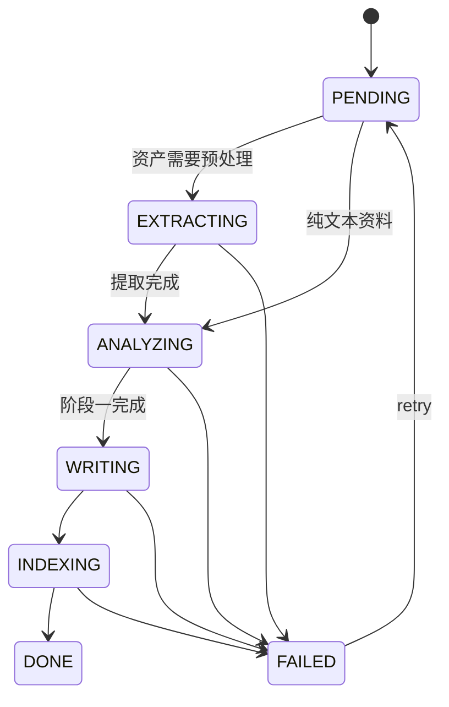

# AI Obsidian Wiki 技术方案 v0.2

版本：v0.2  
日期：2026-05-06  
状态：v0.1 之后的增量方案

## 1. 目标与边界

v0.2 在 v0.1 已稳定的 Vault、摄入、Wiki、Chat、Search Service 之上扩展能力，让同一个 Obsidian Vault 同时服务真人 Web Chat 和外部 AI 应用。

v0.2 做：

- Public REST RAG API：检索、回答、读页、列表、外部投喂、任务轮询。
- API Key 体系：创建、撤销、禁用、过期、scope 校验、基础调用日志。
- 可选向量检索：Qdrant + bge-m3，和 v0.1 关键词检索做 RRF 融合。
- 多模态摄入：图片 OCR + VLM caption；音频/视频转写以异步任务和开关形式提供。
- Chat 增强：多轮短期记忆、固定消息、主动推荐、保存模式升级。
- Settings / API Console 的基础页面：Key 管理、RAG 调试、最近调用记录。

v0.2 不做：

- MCP Server。放到 v0.3，作为独立 stdio-to-HTTP adapter 实现。
- Webhook。放到 v0.3。
- Reranker。放到 v0.3，v0.2 只预留字段，不进入完成标准。
- 完整审计面板和复杂配额运营。v0.2 只做基础日志和可用的后端限制。

## 2. 关键决策

| 决策点 | v0.2 选择 | 说明 |
|--------|----------|------|
| 向量库 | Qdrant，可关闭 | 独立部署，不污染 MySQL；`vector_backend=none` 可回退 v0.1 |
| Embedding | bge-m3，1024 维 | 中英混合资料更稳；可本地或云端 HTTP |
| MCP Server | v0.3 | v0.2 先稳定 REST API，MCP 后续只做协议适配 |
| 多模态 | 图片优先，音视频开关化 | 图片 OCR/caption 价值高且链路短；音视频依赖算力和 ffmpeg |
| API Key | 明文只展示一次，服务端 HMAC 哈希存储 | 区分外部 API Key 和 LLM Provider Key |
| Webhook | v0.3 | v0.2 用任务轮询 |
| Reranker | v0.3 | v0.2 先验证 Hybrid Search 基线 |

## 3. 总体架构演进



关键原则：

- FE 内部 API 和 Public RAG API 共用 Service 层。
- Public RAG API 只暴露稳定、机读、可鉴权的能力。
- MCP 不在 v0.2 进程图中，避免未实现的协议层污染设计。
- 向量检索是 Strategy，可随时回退到 v0.1 KeywordSearch。

## 4. 后端模块新增

```text
src/main/java/com/jihao/aiwiki/
  controller/
    PublicRagController.java         # /api/v1/rag/*
    ApiKeyController.java            # /api/settings/api-keys
    ApiCallLogController.java        # /api/settings/api-call-logs
  service/
    PublicRagService.java
    ApiKeyService.java
    ApiCallLogService.java
    MultimodalService.java
    HybridSearchService.java
    impl/
  domain/
    auth/
      ApiKeyAuthInterceptor.java
      ApiKeyHasher.java
      RateLimitGuard.java
    multimodal/
      OcrClient.java
      VlmClient.java
      WhisperClient.java
      FfmpegHelper.java
      AssetExtractor.java
    vector/
      VectorStoreClient.java
      QdrantVectorStoreClient.java
      EmbeddingClient.java
      ChunkingStrategy.java
    rag/
      HybridRanker.java
      RrfFusion.java
      ContextAssembler.java
```

v0.3 再新增：

```text
aiwiki-mcp/
  McpServerBootstrap.java
  PublicRagHttpClient.java
  tools/
    WikiSearchTool.java
    WikiReadTool.java
    WikiListTool.java
    WikiIngestTool.java
```

MCP 子工程只做 stdio-to-HTTP adapter，不依赖核心 Service 层。它通过本地 `http://127.0.0.1:8080/api/v1/rag/*` 调用主服务，避免 MCP 进程频繁启停影响主服务连接池、缓存和 Worker。

## 5. 数据库变更

v0.2 仍采用应用层约束，不强制数据库外键。所有 `vault_id`、`source_id`、`api_key_id` 在 Service 层校验归属关系。

### 5.1 新增表

```sql
CREATE TABLE api_key (
  id BIGINT PRIMARY KEY AUTO_INCREMENT COMMENT '主键 ID',
  vault_id BIGINT NOT NULL COMMENT 'Vault ID',
  name VARCHAR(128) NOT NULL COMMENT 'Key 用途名称',
  key_hash VARCHAR(128) NOT NULL COMMENT 'HMAC-SHA256 后的 Key 哈希',
  key_prefix VARCHAR(16) NOT NULL COMMENT 'Key 前缀，仅展示用',
  scopes JSON NOT NULL COMMENT '权限范围',
  qps_limit INT NOT NULL DEFAULT 10 COMMENT 'QPS 上限',
  monthly_quota INT NOT NULL DEFAULT 10000 COMMENT '月调用上限',
  used_this_month INT NOT NULL DEFAULT 0 COMMENT '本月已用',
  enabled TINYINT NOT NULL DEFAULT 1 COMMENT '是否启用',
  expires_at DATETIME DEFAULT NULL COMMENT '过期时间',
  create_time DATETIME NOT NULL DEFAULT CURRENT_TIMESTAMP,
  update_time DATETIME NOT NULL DEFAULT CURRENT_TIMESTAMP ON UPDATE CURRENT_TIMESTAMP,
  UNIQUE KEY uk_key_hash (key_hash),
  KEY idx_vault_enabled (vault_id, enabled)
) COMMENT='外部 API Key';

CREATE TABLE api_call_log (
  id BIGINT PRIMARY KEY AUTO_INCREMENT COMMENT '主键 ID',
  api_key_id BIGINT NOT NULL COMMENT 'API Key ID',
  endpoint VARCHAR(128) NOT NULL COMMENT '调用接口',
  query_text VARCHAR(1024) DEFAULT NULL COMMENT '查询语句摘要，必须脱敏和截断',
  response_tokens INT DEFAULT 0 COMMENT '响应 token 数',
  latency_ms INT NOT NULL COMMENT '延迟毫秒',
  status VARCHAR(32) NOT NULL COMMENT 'SUCCESS/ERROR/RATE_LIMITED',
  error_message VARCHAR(512) DEFAULT NULL,
  create_time DATETIME NOT NULL DEFAULT CURRENT_TIMESTAMP,
  KEY idx_key_time (api_key_id, create_time DESC),
  KEY idx_status_time (status, create_time DESC)
) COMMENT='API 调用日志';

CREATE TABLE asset (
  id BIGINT PRIMARY KEY AUTO_INCREMENT COMMENT '主键 ID',
  vault_id BIGINT NOT NULL,
  source_id BIGINT DEFAULT NULL COMMENT '关联 source_document',
  asset_path VARCHAR(1024) NOT NULL COMMENT 'raw/assets/ 下相对路径',
  modality VARCHAR(32) NOT NULL COMMENT 'IMAGE/AUDIO/VIDEO',
  extraction_status VARCHAR(32) NOT NULL COMMENT 'PENDING/RUNNING/DONE/FAILED',
  extraction_method VARCHAR(64) DEFAULT NULL COMMENT '使用的工具/模型',
  extracted_text MEDIUMTEXT DEFAULT NULL,
  metadata JSON DEFAULT NULL COMMENT '时长/分辨率/OCR 置信度等',
  create_time DATETIME NOT NULL DEFAULT CURRENT_TIMESTAMP,
  update_time DATETIME NOT NULL DEFAULT CURRENT_TIMESTAMP ON UPDATE CURRENT_TIMESTAMP,
  KEY idx_vault_status (vault_id, extraction_status),
  KEY idx_source (source_id)
) COMMENT='多模态资产';
```

### 5.2 现有表扩展

```sql
ALTER TABLE wiki_page
  ADD COLUMN modality VARCHAR(32) NOT NULL DEFAULT 'TEXT' AFTER type,
  ADD COLUMN summary VARCHAR(1024) DEFAULT NULL AFTER tags,
  ADD COLUMN embedding_id VARCHAR(128) DEFAULT NULL AFTER content_hash,
  ADD KEY idx_embedding_id (embedding_id);

ALTER TABLE source_document
  ADD COLUMN modality VARCHAR(32) NOT NULL DEFAULT 'TEXT' AFTER type,
  ADD COLUMN extraction_method VARCHAR(64) DEFAULT NULL AFTER status,
  ADD COLUMN idempotency_key VARCHAR(128) DEFAULT NULL AFTER source_url,
  ADD UNIQUE KEY uk_vault_idempotency (vault_id, idempotency_key);

ALTER TABLE app_setting
  ADD COLUMN vector_backend VARCHAR(32) NOT NULL DEFAULT 'NONE' AFTER embedding_enabled,
  ADD COLUMN vector_endpoint VARCHAR(512) DEFAULT NULL,
  ADD COLUMN vector_api_key_cipher TEXT DEFAULT NULL,
  ADD COLUMN reranker_enabled TINYINT NOT NULL DEFAULT 0,
  ADD COLUMN reranker_model VARCHAR(128) DEFAULT NULL,
  ADD COLUMN public_api_enabled TINYINT NOT NULL DEFAULT 0;
```

`reranker_enabled` 和 `reranker_model` 只做预留，v0.2 页面不开放配置。

### 5.3 枚举

- `ModalityEnum`：`TEXT`、`IMAGE`、`AUDIO`、`VIDEO`、`MIXED`
- `AssetStatusEnum`：`PENDING`、`RUNNING`、`DONE`、`FAILED`
- `ApiCallStatusEnum`：`SUCCESS`、`ERROR`、`RATE_LIMITED`
- `ApiScopeEnum`：`SEARCH`、`ANSWER`、`READ`、`LIST`、`INGEST`、`TASK_READ`
- `VectorBackendEnum`：`NONE`、`QDRANT`

## 6. Public RAG API

所有外部接口位于 `/api/v1/rag/*`，与内部 `/api/*` 路径明确分离。

| Method | Path | Scope | 说明 |
|--------|------|-------|------|
| POST | `/api/v1/rag/search` | `SEARCH` | 检索片段，不调 LLM |
| POST | `/api/v1/rag/answer` | `ANSWER` | 检索 + LLM 生成，支持 JSON 或 SSE |
| GET | `/api/v1/rag/page` | `READ` | 读取单个 Wiki 页面 |
| GET | `/api/v1/rag/list` | `LIST` | 按类型 / 标签列出页面 |
| POST | `/api/v1/rag/ingest` | `INGEST` | 投喂资料并进入摄入队列 |
| GET | `/api/v1/rag/tasks/{taskId}` | `TASK_READ` | 轮询外部投喂任务状态 |

### 6.1 search

```json
{
  "query": "Agent Memory 的设计模式",
  "topK": 5,
  "filters": {
    "type": ["CONCEPT", "SYNTHESIS"],
    "tags": ["agent"],
    "updatedAfter": "2026-01-01"
  },
  "expandWikilinks": true,
  "maxTokens": 4000
}
```

响应：

```json
{
  "code": 200,
  "data": {
    "chunks": [
      {
        "path": "wiki/concepts/agent-memory.md",
        "title": "Agent Memory",
        "type": "CONCEPT",
        "modality": "TEXT",
        "score": 0.87,
        "content": "Agent Memory 通常分为三层...",
        "frontmatter": { "tags": ["agent"], "updated": "2026-04-30" },
        "wikilinks": ["wiki/concepts/short-term-memory.md"]
      }
    ],
    "totalTokens": 3580,
    "queryId": "q-20260506-001",
    "latencyMs": 118
  }
}
```

### 6.2 answer

请求字段在 search 基础上增加：

- `stream`：是否用 SSE 返回。
- `saveConversation`：是否写入 Chat 会话，默认 false。
- `sessionId`：可选，内部 Chat 复用时传入。

SSE 事件：

```text
event: retrieval
data: {"keywordHits":12,"vectorHits":18,"merged":23,"vectorEnabled":true}

event: reference
data: [{...}]

event: delta
data: {"content":"..."}

event: done
data: {"messageId":1001,"latencyMs":2840,"totalTokens":3580}
```

### 6.3 ingest

v0.2 不提供 Webhook，调用方通过任务接口轮询。

```http
POST /api/v1/rag/ingest
Content-Type: application/json
Authorization: Bearer sk-aw-***
Idempotency-Key: ingest-20260506-001

{
  "type": "url",
  "url": "https://blog.example.com/post",
  "title": "可选标题",
  "tags": ["agent", "rag"]
}
```

返回：

```json
{
  "code": 200,
  "data": {
    "taskId": "task-20260506-101",
    "sourceId": 1024,
    "status": "PENDING"
  }
}
```

`Idempotency-Key` 可选但推荐。若同一 `vault_id + idempotency_key` 已存在，接口返回已有任务，不重复创建 source 和 task。

### 6.4 task read

```json
{
  "code": 200,
  "data": {
    "taskId": "task-20260506-101",
    "sourceId": 1024,
    "status": "PROCESSING",
    "stage": "ANALYZING",
    "progress": 65,
    "retryCount": 0,
    "errorMessage": null,
    "writtenFiles": []
  }
}
```

## 7. API Key 鉴权

### 7.1 创建与存储

- 明文 Key 只在创建接口返回一次。
- Key 格式：`sk-aw-{prefix}.{secret}`。
- `prefix` 用于 UI 展示和日志定位，不参与权限判断。
- 服务端存储 `HMAC-SHA256(server_secret, plaintext_key)`，不存明文。
- `server_secret` 从本机配置或环境变量读取，不入库。
- LLM Provider Key 仍使用 v0.1 的加密存储，两类 Key 不混用。

### 7.2 鉴权流程



### 7.3 限流与日志边界

v0.2 做：

- Redis 计数实现每 Key QPS 限制。
- `used_this_month` 可异步聚合刷新。
- `api_call_log` 保存 endpoint、latency、status、token 数、脱敏 query 摘要。

v0.3 再做：

- 完整审计面板。
- 复杂配额策略。
- IP 黑名单和异常模式检测。
- Key 轮换提醒。

## 8. Hybrid Search

v0.2 检索链路：

```text
用户 query
  ├─> KeywordRetriever  (v0.1 标题/文件名/正文打分) -> top 20
  ├─> VectorRetriever   (Qdrant, 可关闭)             -> top 20
  └─> WikilinkExpander  (基于已召回的 wikilink 一跳) -> +N

  -> RRF Fusion (k=60)                               -> top 30
  -> ContextAssembler (按 maxTokens 截断 + 引用保留) -> top K
```

Reranker 不在 v0.2 执行链路中。

### 8.1 Embedding 与向量库

| 组件 | 选型 | 备注 |
|------|------|------|
| Embedding 模型 | `bge-m3` | 1024 维，中英多语言 |
| 向量库 | Qdrant | Collection 名 `aiwiki_{vaultId}` |
| Chunk 策略 | 按 Markdown heading 切分，每块不超过 800 字符，overlap 100 | frontmatter 不进入 embedding |
| 索引时机 | Wiki 页面 `content_hash` 变化时增量 upsert | 删除页面时同步 delete |

`wiki_page.embedding_id` 只存页面级索引批次或主 chunk id。具体 chunk point id 建议采用确定性 ID：

```text
{vaultId}:{pagePathHash}:{chunkIndex}:{contentHash}
```

### 8.2 回退策略

- `vector_backend=NONE` 时只走 v0.1 KeywordSearch。
- Qdrant 不可用时记录错误并降级 KeywordSearch，不影响 Chat 和 Public API。
- 向量索引失败不阻止 Markdown 写入，只标记 `last_indexed_at` 不更新。

## 9. 多模态摄入

### 9.1 支持范围

| 模态 | v0.2 策略 | 备注 |
|------|-----------|------|
| 图片 | OCR + VLM caption | 优先交付 |
| 音频 | Whisper 转写 + 时间戳分段 | 默认开关关闭，依赖本地或云端 ASR 配置 |
| 视频 | ffmpeg 抽音频 + Whisper；关键帧 caption 可选 | 默认开关关闭，需限制大小和时长 |
| 网页图表 | Jsoup 正文为主，截图 + VLM 作为可选增强 | 不阻塞 URL 导入 |
| 代码仓库 / 文件夹 | v0.3 评审 | 不进入 v0.2 完成标准 |

### 9.2 状态机

多模态提取作为 ingest_task 的前置步骤：



实现要点：

- `EXTRACTING` 复用 v0.1 的 `stage` 字段。
- 长音频/视频进度推送频率为 5 秒一次。
- 提取失败保留原始 asset，标记 `extraction_status=FAILED`。
- 图片和视频 URL 抓取必须复用 v0.1 SSRF 校验。
- VLM 请求和响应日志只记录 hash、模型、耗时、token 数，不落原图和完整 caption。

### 9.3 多模态 frontmatter

```yaml
---
type: source
title: Knowledge Graph Talk
modality: VIDEO
asset_refs:
  - raw/assets/knowledge-graph-talk.mp4
extraction_method: whisper-large-v3 + qwen-vl-max
extracted_at: 2026-05-06
duration_seconds: 1832
chapters:
  - { start: 0, end: 272, title: "引言" }
  - { start: 273, end: 738, title: "实体抽取" }
---
```

`MarkdownFrontmatterValidator` 增加：

- `modality` 必须属于枚举。
- `asset_refs` 必须以 `raw/assets/` 开头。
- `asset_refs` 只能引用当前 Vault 内 canonical path 下的文件。

## 10. Chat 增强

### 10.1 多轮短期记忆

- 每个 `chat_session` 默认注入最近 6 轮对话。
- 用户可固定消息，固定消息优先于最近消息。
- 上下文预算优先级：固定消息 > 当前问题 > 检索片段 > 最近消息。

### 10.2 主动推荐

回答完成后可返回：

- `relatedPages`：相关但未引用的 Wiki 页面。
- `openQuestions`：当前资料不足以回答的子问题。

这些字段用于前端引导用户继续投喂资料，不强制写入 Vault。

### 10.3 答案沉淀升级

保存模式：

- `SYNTHESIS`：保存为 `wiki/synthesis/*.md`。
- `QUESTION`：保存为 `wiki/questions/*.md`。
- `APPEND`：追加到已有页面的“补充”段落。

`APPEND` 仍必须经过 FILE block 或等价的结构化 patch 校验，禁止模型直接改文件。

## 11. 前端页面调整

Settings 新增：

- API Keys 管理：创建、撤销、禁用、查看 prefix、scope、过期时间。
- Vector 设置：开关、Qdrant endpoint、连通性测试。
- Multimodal 设置：图片 OCR/caption 开关，音视频处理开关和限制。

新增 API Console：

- 输入 query 测试 `/api/v1/rag/search`。
- 选择是否流式测试 `/api/v1/rag/answer`。
- 展示 retrieval / reference / delta / done 事件。
- 查看最近调用日志，v0.2 只做列表，不做复杂分析。

MCP 配置页面不在 v0.2 交付，只在 v0.3 增加。

## 12. 安全增强

| 风险点 | v0.2 措施 |
|--------|-----------|
| 外部 Key 泄漏 | HMAC 哈希存储；明文只展示一次；日志只打 `key_prefix` |
| scope 越权 | Interceptor 统一校验 scope，不进入业务后再判断 |
| 调用方滥用 | 基础 QPS + 月配额；全局 `public_api_enabled` 熔断 |
| 外部 ingest 重复创建任务 | `Idempotency-Key` 支持幂等 |
| 多模态 SSRF | 图片 / 视频 / 网页抓取统一走 SSRF 校验 |
| VLM 提示词注入 | caption 作为非可信资料进入资料分析 prompt，由 system prompt 包裹 |
| 向量库越权 | Collection 名带 vaultId，Service 层强制按 vaultId 过滤 |
| 敏感日志 | query 截断脱敏；不记录完整 Authorization、Cookie、API Key、模型原始响应 |

## 13. 性能与容量预估

| 场景 | v0.2 目标 | 实现保障 |
|------|-----------|----------|
| 1000 篇 Markdown 关键词 + 向量召回 | < 300ms | Qdrant + MySQL 并发查询，失败降级 |
| Public answer 首 token | < 1.5s | 召回完成后立即发 retrieval，再开始 LLM SSE |
| 10 万次 / 月 API 调用 | 单机可承载 | Redis QPS 计数 + 异步日志 |
| 30 分钟音频转写 | GPU 5-8 分钟，CPU 25 分钟以内 | 独立提取阶段，不阻塞其他 Vault |
| 向量库容量 | 5 万 chunk 约 200MB 级别 | Qdrant 单机支撑 |

## 14. 开发顺序

1. 数据库迁移：新增 3 表 + 现有表加字段。
2. API Key 模块：创建、列表、撤销、禁用、HMAC 哈希存储。
3. Public RAG API：先复用 v0.1 KeywordSearch，完成鉴权和 OpenAPI。
4. 外部 ingest：支持 `Idempotency-Key` 和任务轮询接口。
5. 基础限流与调用日志：Redis QPS、月用量、脱敏日志。
6. 向量检索：bge-m3 + Qdrant + chunk 策略 + 增量索引。
7. RRF 融合：关键词、向量、wikilink 一跳合并。
8. 多模态图片：OCR + VLM caption + frontmatter 校验。
9. 音频/视频：在开关保护下接入 Whisper / ffmpeg。
10. Chat 增强：短期记忆、固定消息、主动推荐、保存模式。
11. 前端：API Key 管理、Vector 设置、Multimodal 设置、API Console。

## 15. 测试策略

单元测试：

- `ApiKeyHasherTest`：HMAC 一致性、明文不可逆、prefix 不参与鉴权。
- `ApiKeyAuthInterceptorTest`：过期、禁用、scope 不足。
- `RateLimitGuardTest`：QPS 边界、月配额边界、并发计数。
- `RrfFusionTest`：双路召回融合、空召回边界。
- `ChunkingStrategyTest`：Markdown heading 切分、长段落兜底。
- `AssetFrontmatterValidatorTest`：`asset_refs` 路径校验。
- `WhisperClientTest`：mock 进程，验证时间戳解析。
- `VlmClientTest`：mock HTTP，验证 caption 字段提取和日志脱敏。

集成测试：

- 创建 Key -> 撤销 -> 调用返回 401。
- scope 只有 `SEARCH` 的 Key 调 `/answer` 返回 403。
- ingest 接口带同一 `Idempotency-Key` 重复调用只产生一个任务。
- `/api/v1/rag/tasks/{taskId}` 返回任务阶段和进度。
- 启用 Qdrant -> 写入新页面 -> 出现对应 point。
- Qdrant 不可用 -> search 降级关键词召回。
- 图片上传 -> EXTRACTING -> DONE -> Wiki frontmatter 带 `asset_refs`。

端到端验收：

- API Console 可完成 search 和 answer 调用。
- Public API 返回结构化引用，引用路径可在 Wiki 页面打开。
- 撤销 Key 后该 Key 立即无法调用任何 Public API。
- 启用向量后端后，1000 篇 Markdown 召回 < 300ms。
- 上传一张包含图表的图片，Vault 内出现带 OCR 文本与 VLM caption 的 Markdown。
- 音频/视频开关开启且依赖可用时，可以生成带时间戳分段的 Markdown。

## 16. 风险与回退

| 风险 | 影响 | 回退方案 |
|------|------|----------|
| Qdrant 部署失败或不可用 | 向量检索不可用 | `vector_backend=NONE` 回退 v0.1 关键词检索 |
| Embedding 模型慢或失败 | 索引延迟 | Markdown 先写入，索引异步补偿 |
| Whisper 本地资源不足 | 长音频提取失败 | 关闭音视频开关，或切云端 ASR |
| VLM 云端额度耗尽 | 图片 caption 缺失 | 降级为 OCR-only |
| Public API 被滥用 | 主服务过载 | `public_api_enabled=0` 全局熔断 |
| API Key 哈希 secret 丢失 | 旧 Key 无法验证 | 要求重新生成外部 Key；LLM Provider Key 不受影响 |

## 17. v0.2 完成标准

- v0.1 功能全部保持可用。
- 数据库迁移完成，可回滚。
- Settings 页面可创建、禁用、撤销 API Key，明文仅展示一次。
- `/api/v1/rag/search`、`/api/v1/rag/answer`、`/api/v1/rag/page`、`/api/v1/rag/list` 通过 OpenAPI 测试。
- `/api/v1/rag/ingest` 支持幂等投喂，`/api/v1/rag/tasks/{taskId}` 可轮询状态。
- 鉴权、scope 校验、基础限流和脱敏调用日志生效。
- API Console 可展示 retrieval / reference / delta / done 完整事件流。
- 启用向量后端后，Hybrid Search 可工作；关闭或故障时能回退关键词检索。
- 图片多模态摄入可生成带 OCR 文本、caption 和 `asset_refs` 的 Markdown。
- MCP Server、Webhook、Reranker 不属于 v0.2 验收项，另开 v0.3 技术方案。
