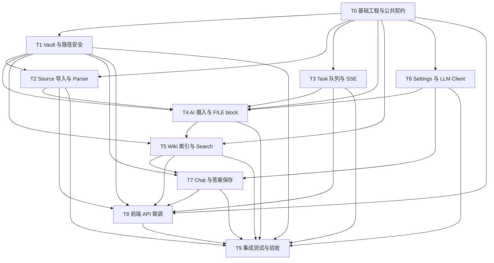

# AI Obsidian Wiki v0.1 并行开发任务拆分

日期：2026-05-06  
适用范围：`ai-obsidian-wiki-technical-design-v0.1.md`  
目标：把一期 MVP 拆成多个低冲突任务，便于分配给多个 AI 并行开发。

## 1. 拆分原则

- 后端当前为空目录，必须先由一个 AI 完成基础工程和公共契约，再放开模块并行。
- 每个 AI 只改自己任务的文件边界；跨模块 DTO/VO、公共异常、数据库迁移必须走 T0 契约。
- 任务按 Service 边界拆分，而不是按页面拆分，避免业务逻辑散落在 Controller。
- 文件系统写入和 LLM 输出写入是最高风险点，必须由独立任务负责并提供测试。
- 前端已有 mock 页面，前端 AI 可以先搭 API client 和状态适配，后端接口 ready 后再切真实数据。

## 2. 总体并行图



## 3. 共享约定

### 3.1 分支与合并

建议每个 AI 使用独立分支：

- `codex/v01-t0-foundation`
- `codex/v01-t1-vault`
- `codex/v01-t2-source-parser`
- `codex/v01-t3-task-queue`
- `codex/v01-t4-ingest`
- `codex/v01-t5-wiki-search`
- `codex/v01-t6-settings-llm`
- `codex/v01-t7-chat`
- `codex/v01-t8-frontend-api`
- `codex/v01-t9-e2e`

合并顺序：

1. T0 先合并。
2. T1、T3、T6 可并行合并。
3. T2、T5 在 T1 后合并。
4. T4 在 T1/T2/T3/T6 后合并。
5. T7 在 T5/T6 后合并。
6. T8 可持续 rebase，最终在主要后端接口后合并。
7. T9 最后合并。

### 3.2 公共响应与错误码

所有接口返回：

```json
{
  "code": 200,
  "message": "success",
  "data": {}
}
```

公共错误码由 T0 定义，其他任务只能新增具体错误枚举，不能改响应形状。

### 3.3 数据库迁移

T0 建立迁移目录和基础表。各任务如需改表，只能追加迁移文件，不直接重写已有迁移。

建议命名：

```text
backend/src/main/resources/db/migration/
  V001__init_v01_schema.sql
  V002__task_queue_indexes.sql
```

### 3.4 测试约定

每个任务必须至少提供：

- 模块级单元测试。
- Controller 或 Service 集成测试，涉及文件系统的使用临时目录。
- 一份 `README` 或测试说明，写明如何验证。

## 4. 任务卡

## T0：基础工程与公共契约

目标：搭好后端 Spring Boot 工程骨架、公共响应、异常、数据库迁移和 OpenAPI 基础，让其他 AI 能在稳定契约上并行开发。

负责人建议：1 个 AI，优先执行。

文件边界：

- `backend/pom.xml`
- `backend/src/main/java/com/jihao/aiwiki/AiWikiApplication.java`
- `backend/src/main/java/com/jihao/aiwiki/common/**`
- `backend/src/main/java/com/jihao/aiwiki/config/**`
- `backend/src/main/resources/application.yml`
- `backend/src/main/resources/db/migration/V001__init_v01_schema.sql`
- `backend/src/test/**` 基础测试配置

必须交付：

- Spring Boot 3.5.10 + Java 21 工程可启动。
- MyBatis、MySQL、Redis、springdoc-openapi、Log4j2 配置完成。
- `ApiResponse<T>`、`PageResult<T>`、`BusinessException`、`ErrorCode`、`GlobalExceptionHandler`。
- 基础表迁移：`vault_project`、`source_document`、`ingest_task`、`wiki_page`、`chat_session`、`chat_message`、`app_setting`。
- 包结构和命名规范固定。
- 空的接口类可以先建出来：`VaultService`、`SourceDocumentService`、`IngestTaskService`、`WikiPageService`、`SearchService`、`SettingService`、`ChatService`。

验收：

- `mvn test` 通过。
- `/v3/api-docs` 可访问。
- 应用能在无业务数据时启动。

禁止：

- 不实现具体业务逻辑。
- 不引入 v0.2 的 API Key、Qdrant、多模态表。

## T1：Vault 与路径安全

目标：实现 Vault 初始化、路径校验、安全读写、目录结构创建和备份能力。

文件边界：

- `backend/src/main/java/com/jihao/aiwiki/controller/VaultController.java`
- `backend/src/main/java/com/jihao/aiwiki/service/VaultService.java`
- `backend/src/main/java/com/jihao/aiwiki/service/impl/VaultServiceImpl.java`
- `backend/src/main/java/com/jihao/aiwiki/domain/vault/**`
- `backend/src/main/java/com/jihao/aiwiki/dto/vault/**`
- `backend/src/main/java/com/jihao/aiwiki/vo/vault/**`
- `backend/src/main/java/com/jihao/aiwiki/mapper/VaultProjectMapper.java`
- `backend/src/main/java/com/jihao/aiwiki/entity/VaultProjectDO.java`

接口：

- `POST /api/vault/init`
- `GET /api/vault/detail`
- `POST /api/vault/reindex` 可先返回任务创建或同步重建占位，具体索引由 T5 完成。

必须交付：

- `VaultPathValidator`：拒绝绝对路径注入、`../`、Windows 盘符、空字节、软链逃逸。
- `VaultFileService`：只接受 Vault 内相对路径，所有读写前做 canonical path 校验。
- 初始化缺失目录：`purpose.md`、`schema.md`、`raw/`、`wiki/`、`.ai-wiki/`。
- 原子写入工具：先写临时文件，再 replace。
- `.ai-wiki/history/{timestamp}/` 备份工具。

验收：

- `VaultPathValidatorTest` 覆盖路径穿越、软链、绝对路径、合法路径。
- 初始化不会修改 `.obsidian/`。
- 绑定已有 Vault 不覆盖已有 `purpose.md` / `schema.md`。

依赖：

- T0。

## T2：Source 导入与 Parser

目标：实现文件上传、URL 导入、资料列表、解析预览和基础文本解析。

文件边界：

- `backend/src/main/java/com/jihao/aiwiki/controller/SourceController.java`
- `backend/src/main/java/com/jihao/aiwiki/service/SourceDocumentService.java`
- `backend/src/main/java/com/jihao/aiwiki/service/impl/SourceDocumentServiceImpl.java`
- `backend/src/main/java/com/jihao/aiwiki/domain/parser/**`
- `backend/src/main/java/com/jihao/aiwiki/dto/source/**`
- `backend/src/main/java/com/jihao/aiwiki/vo/source/**`
- `backend/src/main/java/com/jihao/aiwiki/mapper/SourceDocumentMapper.java`
- `backend/src/main/java/com/jihao/aiwiki/entity/SourceDocumentDO.java`

接口：

- `POST /api/sources/upload`
- `POST /api/sources/import-url`
- `GET /api/sources/page`
- `GET /api/sources/detail`
- `GET /api/sources/preview`
- `POST /api/sources/{id}/parse`
- `POST /api/sources/{id}/ingest` 可调用 T3 的任务创建接口。

必须交付：

- 文件名 slug 化和冲突处理。
- 原始文件保存到 `raw/sources/files/`。
- URL 抓取保存到 `raw/sources/webclips/`。
- 解析文本保存到 `.ai-wiki/cache/`。
- Parser 支持 PDF、TXT、Markdown、JSON、CSV、HTML/URL、DOCX/PPTX/XLSX 基础抽取。
- URL SSRF 防护：禁止内网 IP、localhost、metadata 地址。

验收：

- 上传 TXT/Markdown 可预览解析文本。
- URL 导入能抽标题、正文、原链接。
- 解析失败保留原始文件并写入 `error_message`。
- `SourceDocumentServiceTest` 覆盖文件名冲突和解析失败。

依赖：

- T0。
- T1 的 `VaultFileService`。
- T3 的任务创建接口可用后，补齐 `/ingest`。

## T3：Ingest Task 队列与 SSE

目标：实现摄入任务表、单 Vault 串行队列、任务恢复、重试、取消和进度 SSE。

文件边界：

- `backend/src/main/java/com/jihao/aiwiki/controller/IngestTaskController.java`
- `backend/src/main/java/com/jihao/aiwiki/service/IngestTaskService.java`
- `backend/src/main/java/com/jihao/aiwiki/service/impl/IngestTaskServiceImpl.java`
- `backend/src/main/java/com/jihao/aiwiki/domain/ingest/queue/**`
- `backend/src/main/java/com/jihao/aiwiki/dto/task/**`
- `backend/src/main/java/com/jihao/aiwiki/vo/task/**`
- `backend/src/main/java/com/jihao/aiwiki/mapper/IngestTaskMapper.java`
- `backend/src/main/java/com/jihao/aiwiki/entity/IngestTaskDO.java`

接口：

- `GET /api/tasks/page`
- `GET /api/tasks/detail`
- `POST /api/tasks/{taskId}/retry`
- `POST /api/tasks/{taskId}/cancel`
- `GET /api/tasks/stream`

必须交付：

- 同一 `vault_id` 同时只允许一个 `PROCESSING`。
- Redis lock：`vault:{vaultId}:ingest-lock`。
- `stage`、`heartbeat_at`、`started_at`、`finished_at` 更新。
- 自动重试最多 3 次。
- 启动时恢复 `PENDING` 和心跳超时 `PROCESSING`。
- `WRITING` 阶段崩溃不自动覆盖，标记人工检查。
- SSE 推送 task progress。

验收：

- 并发创建多个任务时，同 Vault 串行执行。
- 取消 `PENDING` 成功，取消 `WRITING` 失败并返回明确错误。
- `IngestTaskRecoveryTest` 覆盖心跳超时和恢复。

依赖：

- T0。
- T4 会接入具体 worker 执行逻辑；T3 先提供执行框架和可注入 handler。

## T4：AI 摄入与 FILE block 写入

目标：实现两阶段 AI 摄入、FILE block 解析、frontmatter 校验和安全写入。

文件边界：

- `backend/src/main/java/com/jihao/aiwiki/domain/ingest/**`
- `backend/src/main/java/com/jihao/aiwiki/domain/llm/**` 中只使用 T6 提供接口，不改 T6 实现。
- `backend/src/main/java/com/jihao/aiwiki/service/impl/IngestPipelineServiceImpl.java`
- `backend/src/main/java/com/jihao/aiwiki/dto/ingest/**`
- `backend/src/main/java/com/jihao/aiwiki/vo/ingest/**`

必须交付：

- 阶段一 prompt：资料分析 JSON。
- 阶段二 prompt：生成 FILE block。
- `FileBlockParser` 支持多文件 block。
- `MarkdownFrontmatterValidator` 校验 `type`、`title`、`sources`、`updated`。
- 只允许写入 `wiki/`。
- 写入前落到 `.ai-wiki/tmp/{taskId}/`，校验后原子替换。
- 更新 `wiki/index.md`、`wiki/log.md`，关键页面写入前备份。
- LLM 输出非法路径时任务失败且不写文件。

验收：

- `FileBlockParserTest` 覆盖正常、多文件、缺 END、非法路径。
- `MarkdownFrontmatterValidatorTest` 覆盖必填字段和 type 枚举。
- mock LLM 返回合法 FILE block 后，Vault 出现 Markdown。
- mock LLM 返回 `../evil.md` 后，任务失败且无文件写入。

依赖：

- T1 `VaultFileService`。
- T2 source parsed text。
- T3 task handler。
- T6 LLM client。

## T5：Wiki 索引与关键词 Search

目标：实现 Wiki 文件树、Markdown 页面读取、frontmatter 展示、索引重建、关键词搜索和 wikilink 一跳扩展。

文件边界：

- `backend/src/main/java/com/jihao/aiwiki/controller/WikiController.java`
- `backend/src/main/java/com/jihao/aiwiki/service/WikiPageService.java`
- `backend/src/main/java/com/jihao/aiwiki/service/SearchService.java`
- `backend/src/main/java/com/jihao/aiwiki/service/impl/WikiPageServiceImpl.java`
- `backend/src/main/java/com/jihao/aiwiki/service/impl/SearchServiceImpl.java`
- `backend/src/main/java/com/jihao/aiwiki/domain/search/**`
- `backend/src/main/java/com/jihao/aiwiki/dto/wiki/**`
- `backend/src/main/java/com/jihao/aiwiki/vo/wiki/**`
- `backend/src/main/java/com/jihao/aiwiki/mapper/WikiPageMapper.java`
- `backend/src/main/java/com/jihao/aiwiki/entity/WikiPageDO.java`

接口：

- `GET /api/wiki/tree`
- `GET /api/wiki/page`
- `POST /api/wiki/open`
- `GET /api/wiki/search`

必须交付：

- 扫描 `wiki/` 构建文件树。
- 解析 frontmatter 和 body。
- 根据 `content_hash` 增量重建 `wiki_page`。
- 搜索标题、文件名、正文关键词。
- wikilink 一跳扩展。
- 按分数、更新时间、页面类型排序。
- 上下文预算裁剪工具给 T7 使用。

验收：

- `KeywordSearchServiceTest` 覆盖标题、文件名、正文、wikilink 权重。
- 1000 篇 Markdown 搜索在本机测试数据下 1 秒内返回。
- `GET /api/wiki/page` 拒绝非 `wiki/` 路径。

依赖：

- T1。
- T4 写入后联调索引更新。

## T6：Settings 与 LLM Client

目标：实现 LLM 配置保存、API Key 加密、连通性测试和统一 LLM 调用接口。

文件边界：

- `backend/src/main/java/com/jihao/aiwiki/controller/SettingController.java`
- `backend/src/main/java/com/jihao/aiwiki/service/SettingService.java`
- `backend/src/main/java/com/jihao/aiwiki/service/impl/SettingServiceImpl.java`
- `backend/src/main/java/com/jihao/aiwiki/domain/llm/**`
- `backend/src/main/java/com/jihao/aiwiki/domain/vault/SecretCipher.java`
- `backend/src/main/java/com/jihao/aiwiki/dto/setting/**`
- `backend/src/main/java/com/jihao/aiwiki/vo/setting/**`
- `backend/src/main/java/com/jihao/aiwiki/mapper/AppSettingMapper.java`
- `backend/src/main/java/com/jihao/aiwiki/entity/AppSettingDO.java`

接口：

- `GET /api/settings/detail`
- `PUT /api/settings/update`
- `POST /api/settings/test-llm`

必须交付：

- LLM API Key 加密存储，VO 只返回 masked key。
- OpenAI-compatible chat completion 调用。
- DashScope 作为配置兼容项，可先实现基础连通性。
- 流式接口抽象，供 T7 使用。
- 日志脱敏 Authorization、api_key、模型响应原文。

验收：

- 更新设置后数据库不出现明文 key。
- `test-llm` 使用 mock client 可通过。
- `LlmClientTest` 覆盖流式 delta 解析。

依赖：

- T0。

## T7：Chat 与答案保存

目标：实现会话、消息、检索增强问答、SSE 流式回答、引用展示和保存回答到 Wiki。

文件边界：

- `backend/src/main/java/com/jihao/aiwiki/controller/ChatController.java`
- `backend/src/main/java/com/jihao/aiwiki/service/ChatService.java`
- `backend/src/main/java/com/jihao/aiwiki/service/impl/ChatServiceImpl.java`
- `backend/src/main/java/com/jihao/aiwiki/domain/chat/**`
- `backend/src/main/java/com/jihao/aiwiki/dto/chat/**`
- `backend/src/main/java/com/jihao/aiwiki/vo/chat/**`
- `backend/src/main/java/com/jihao/aiwiki/mapper/ChatSessionMapper.java`
- `backend/src/main/java/com/jihao/aiwiki/mapper/ChatMessageMapper.java`
- `backend/src/main/java/com/jihao/aiwiki/entity/ChatSessionDO.java`
- `backend/src/main/java/com/jihao/aiwiki/entity/ChatMessageDO.java`

接口：

- `POST /api/chat/session`
- `GET /api/chat/sessions`
- `GET /api/chat/messages`
- `POST /api/chat/stream`
- `POST /api/chat/save-answer`

必须交付：

- 创建会话、查询会话、查询消息。
- 调用 T5 Search 组装上下文。
- 调用 T6 LLM client 流式返回。
- SSE 事件：`reference`、`delta`、`done`、`error`。
- 保存回答到 `wiki/synthesis/` 或 `wiki/questions/`。
- 保存回答仍走 T1 路径校验和 frontmatter 校验。

验收：

- mock Search + mock LLM 可流式返回 answer。
- 引用结构化保存到 `chat_message.references_json`。
- 保存回答后 Wiki 能读到 Markdown 页面。

依赖：

- T1。
- T5。
- T6。

## T8：前端 API 联调

目标：把现有 Vue mock 页面改为调用真实 API，并保留必要 loading、empty、error 状态。

文件边界：

- `frontend/src/api/**`
- `frontend/src/pages/DashboardPage.vue`
- `frontend/src/pages/SourcesPage.vue`
- `frontend/src/pages/TasksPage.vue`
- `frontend/src/pages/ChatPage.vue`
- `frontend/src/pages/WikiPage.vue`
- `frontend/src/pages/SettingsPage.vue`
- `frontend/src/types.ts`
- `frontend/src/utils/**`

必须交付：

- 统一 API client，读取 `VITE_API_BASE_URL`。
- Dashboard 接真实 overview。
- Sources 支持上传、URL 导入、解析预览、触发摄入。
- Tasks 支持列表、重试、取消、SSE 进度。
- Wiki 支持树、页面预览、frontmatter 展示、搜索。
- Chat 支持 SSE 问答、引用点击、保存回答。
- Settings 支持 LLM 配置、masked key、连通性测试。

验收：

- `npm run build` 通过。
- 后端未启动时页面展示错误状态，不白屏。
- 真实后端启动后，完成一条导入 -> 摄入 -> 查看 Wiki -> Chat 引用链路。

依赖：

- 可先基于 v0.1 文档和 mock contract 开发。
- 最终联调依赖 T1-T7。

## T9：集成测试与端到端验收

目标：做跨模块测试，验证一期 MVP 链路稳定。

文件边界：

- `backend/src/test/**`
- `frontend` 可增加必要 e2e 或 smoke 脚本。
- `docs/ai-obsidian-wiki-v0.1-test-report.md`

必须交付：

- 后端集成测试：Vault 初始化、上传解析、任务执行、非法 FILE block、Wiki 搜索、Chat SSE。
- 临时 Vault fixture。
- 端到端验收记录。
- 缺陷清单按模块归属回填给对应 AI。

验收场景：

1. 初始化一个空 Vault。
2. 上传 Markdown 或 TXT，看到解析预览。
3. 触发 AI 摄入，任务从 `PENDING` 到 `DONE`。
4. Vault 出现 `wiki/sources/*.md`。
5. Wiki 页面可预览 frontmatter 和正文。
6. Chat 提问后返回流式答案和引用。
7. 保存回答到 `wiki/synthesis/`。
8. Obsidian 可直接阅读生成的 Markdown。

依赖：

- T1-T8。

## 5. 可直接分发给 AI 的任务提示词

### 给 T0 AI

```text
你负责 AI Obsidian Wiki v0.1 的基础工程与公共契约。只编辑 backend 的工程骨架、common、config、基础迁移和测试配置。不要实现具体业务模块。严格遵循 docs/ai-obsidian-wiki-technical-design-v0.1.md 与 docs/ai-obsidian-wiki-v0.1-parallel-tasks.md 的 T0 范围。完成后确保 mvn test 通过，OpenAPI 可访问。
```

### 给模块 AI

```text
你负责任务 T{编号}：{任务名}。只编辑 docs/ai-obsidian-wiki-v0.1-parallel-tasks.md 中该任务的文件边界。不要重构其他模块，不要修改公共响应形状，不要引入 v0.2 功能。若需要跨模块接口，优先使用 T0 已定义的 Service interface，并在最终说明中列出依赖。完成后运行相关测试并说明验证结果。
```

### 给 T8 前端 AI

```text
你负责 v0.1 前端 API 联调。基于现有 Vue mock 页面改造真实 API client，保留 loading/empty/error 状态。只编辑 frontend/src/api、frontend/src/pages、frontend/src/types.ts、frontend/src/utils。不要改后端。后端接口未 ready 时使用 v0.1 文档契约和 mock fallback，最终在后端合并后切真实 API。
```

### 给 T9 验收 AI

```text
你负责 v0.1 集成测试与端到端验收。不要实现业务功能，除非是测试夹具或测试脚本。根据 docs/ai-obsidian-wiki-technical-design-v0.1.md 和本任务拆分文档编写测试，产出 docs/ai-obsidian-wiki-v0.1-test-report.md，按 T1-T8 归属列出失败项。
```

## 6. 风险控制

- T0 未合并前，其他后端 AI 不要提交 `pom.xml`、`application.yml`、`common/**`、`config/**`。
- T1 的 `VaultFileService` 是文件安全唯一入口，其他任务不得直接用用户传入路径读写文件。
- T4 的 FILE block parser 是 LLM 输出落盘唯一入口，其他任务不得让 LLM 响应直接写文件。
- T6 的 LLM client 是模型调用唯一入口，其他任务不得自行拼 API Key 或打印模型请求。
- T8 不应为适配前端而要求后端改变统一响应结构。
- T9 发现问题只提交测试和报告，业务修复交还对应任务 AI。
